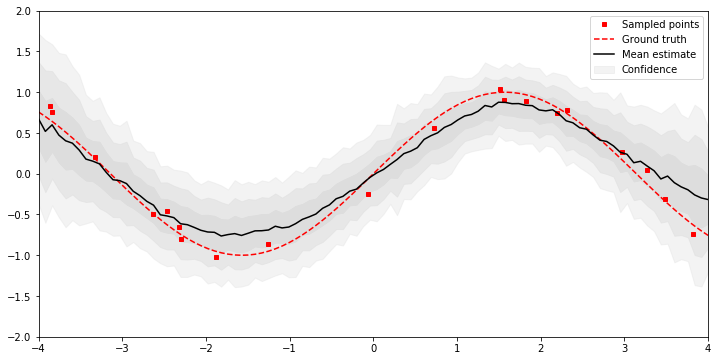

Bayesian Neural Network
=======================

.. image:: https://travis-ci.org/anassinator/bnn.svg?branch=master
  :target: https://travis-ci.org/anassinator/bnn

This is a Bayesian Neural Network (BNN) implementation for
`PyTorch <https://pytorch.org>`_. The implementation follows Yarin Gal's papers
"Dropout as a Bayesian Approximation: Representing Model Uncertainty in Deep
Learning" (see :code:`BDropout`) and "Concrete Dropout" (see :code:`CDropout`).

This package was originally based off the work here:
`juancamilog/prob_mbrl <https://github.com/juancamilog/prob_mbrl>`_.

Install
-------

To install simply clone and run:

.. code-block:: bash

  python setup.py install

You may also install the dependencies with `pipenv` as follows:

.. code-block:: bash

  pipenv install

Finally, you may add this to your own application with either:

.. code-block:: bash

  pip install 'git+https://github.com/anassinator/bnn.git#egg=bnn'
  pipenv install 'git+https://github.com/anassinator/bnn.git#egg=bnn'

Usage
-----

After installation, :code:`import` and use as follows:

.. code-block:: python

  import bnn

You can see the `examples <examples/>`_ directory for some
`Jupyter <https://jupyter.org>`_ notebooks with more detailed examples.

The following is an example of what this BNN was able to estimate
with a few randomly sampled points (in red) of a noisy :code:`sin` function.
The dotted curve represent the real function that was kept a secret from the
model, whereas the black line and the grey area represent the
estimated mean and uncertainty.

Contributing
------------

Contributions are welcome. Simply open an issue or pull request on the matter.

Linting
-------

We use `YAPF <https://github.com/google/yapf>`_ for all Python formatting
needs. You can auto-format your changes with the following command:

.. code-block:: bash

  yapf --recursive --in-place --parallel .

You can install the formatter with:

.. code-block:: bash

  pipenv install --dev

License
-------

See `LICENSE <LICENSE>`_.